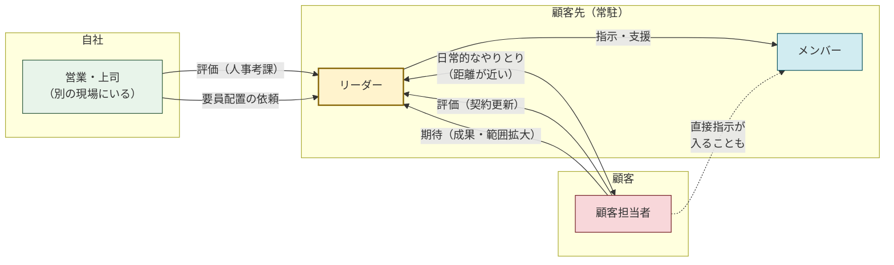
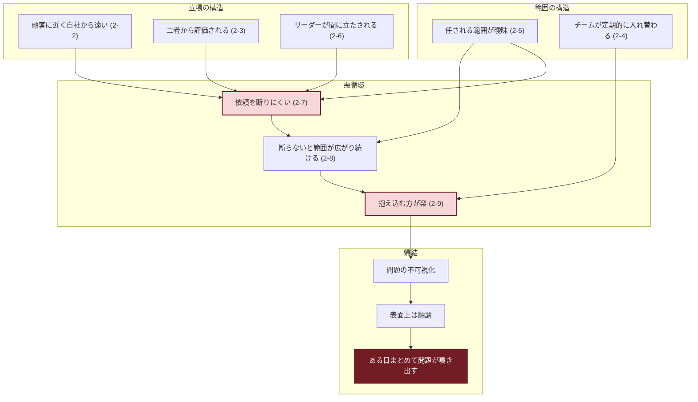

# SESリーダーガイド

-----

## 1. このドキュメントについて

### 1-1. 目的

このドキュメントは、SESリーダーが「次にどう動くか」を考えられるようになるためのガイドです。

SESの現場は毎回違います。メンバー、顧客、契約内容、制約——すべてが異なります。だから「こういう状況ならこうする」というマニュアルは機能しません。

必要なのは、状況が変わっても使える指針と、その指針が生まれた背景の理解です。

### 1-2. 想定する読者

- SESでチームを率いる立場にある人
- これからリーダーになる人
- 顧客常駐で、自社と顧客の間に立つ人

### 1-3. SESリーダーの定義

> SESリーダーとは、SES特有の制約の中で、不確実でも進行できる形を作り、チームと成果が継続する状態を維持する人である。

迷ったときは、この定義に立ち戻ってください。

-----

## 2. SESリーダーの構造的制約

SESリーダーは、一般的なリーダーとは異なる構造の中で働いています。この章では、その構造と、構造から生じる問題を示します。

### 2-1. 構造の全体像

SESリーダーが置かれる構造は、以下の図で整理できます。

この構造から、以下の特性が生じます。

-----

### 2-2. 顧客に近く、自社から遠い構造

リーダーは顧客先に常駐し、顧客と同じ空間で働きます。一方、自社の上司は別の現場にいます。一般企業とは逆転した距離感です。

顧客との距離が近いため、リーダーの決定や行動は自社よりも顧客の意向に沿いやすくなります。

-----

### 2-3. 二者から評価される構造

リーダーは自社（人事考課）と顧客（契約更新）の両方から評価されます。一般企業では自社だけですが、SESでは評価者が二人います。

リーダーは、自社の評価基準だけでなく、顧客側の評価や期待も同時に満たすことを求められます。

-----

### 2-4. チームが定期的に入れ替わる構造

リーダーのチームはプロジェクトごとに組成・解散され、3ヶ月〜1年で入れ替わります。一般企業のように固定されたチームではありません。

人が替わると業務知識・現場ルール・顧客との関係が失われ、任される範囲も一から探り直しになります。「人を入れ替える」コストは軽く見られますが、実際は大きいです。

-----

### 2-5. 任される範囲が曖昧なまま始まる構造

リーダーは、試される立場から始まります。

リーダーに任される範囲は、最初は明確ではありません。顧客や自社の営業からすれば、やらせてみないとわからないからです。

このため、契約には作業範囲が書いてあるものの、実際に任される範囲はズレることがあります。チームが入れ替わるたびに、この探り直しが起きます。

#### 任されている範囲を見極める

任される範囲が曖昧だから、迷います。迷いの多くは「自分で決めていいのに迷っている」か「提案すべきなのに自分で抱えている」のどちらかです。

自分が任されている範囲かどうか、以下で見極めます。

| 判断 | 対象 | 行動 |
|------|------|------|
| **自分で決めてよい** | 日々の段取り、情報整理、小さな改善など、現場で完結できること | 自分で決める |
| **材料を揃えて提案する** | 作業範囲、優先度、仕様、技術方針など、決定権が自分にないもの | 選択肢・影響・コストを整理して提案し、決定を仰ぐ |
| **動かせないものとして受け入れる** | 契約、予算、組織決裁、上からの指示など、自分では動かせないもの | そのまま受け入れる |

-----

### 2-6. リーダーが間に立たされる構造

リーダーは顧客と自社の間に立ちます。

自社の営業や上司の主務は売上・契約・継続です。現場の日常運用をフォローする余裕はありません。

顧客は成果を求めます。契約の建前より、目の前の仕事が回ることを優先します。

この立場の違いが、期待のズレを生みます。誰かが悪いわけではなく、構造の問題です。リーダーは顧客の期待と自社の制約、両方に答える必要があります。

-----

### 2-7. 依頼を断りにくい構造

リーダーは依頼を断りにくい立場にあります。

2-5で述べた通り、任される範囲は曖昧な状態から始まります。リーダーは「どこまでできるか」を証明する必要があり、断りにくくなります。

顧客からの依頼は契約更新に影響します。自社からのアサイン依頼は売上に直結します。どちらも断りにくい。

さらに、断る話を自社経由で持ち出すと会社対会社の議論にエスカレートします。リーダーはこれを避けようとし、現場で抱え込みやすくなります。

-----

### 2-8. 断らないと範囲が広がり続ける構造

リーダーが依頼を断らずこなすと、次はさらに広い依頼が来ます。「できたから次も」という循環で、範囲は広がり続けます。

一度広がった範囲は狭まりません。受けた依頼は「次からも当然」になります。

疲弊してから範囲を狭めようとしても「急にどうした」と受け取られます。それまで受け続けてきた経緯があるからです。

-----

### 2-9. 抱え込む方が楽になる構造

リーダーは、範囲が曖昧で断りにくい状況が続くと、抱え込みを選びやすくなります。

**説明コストが高い**

現場の文脈を自社に説明するにも、メンバーに仕事を渡すにも、コストがかかります。「説明する手間」が「自分でやる手間」を上回ると、抱え込みます。

**無理を吸収すると外から見えなくなる**

リーダーが小さな無理を運用で吸収すると、外からは「順調」に見えます。支援が来ないまま、負荷だけが蓄積します。

-----

### 2-10. この構造はリーダーとメンバーの間でも起きる

2-2から2-9で示した構造は、リーダーとメンバーの間でも同様に起きます。リーダーは自分が受けている構造を、無自覚にメンバーへ再生産しやすい。自分が苦しんでいる構造を、メンバーに押し付けていないか注意が必要です。

-----

### 2-11. 構造が引き起こす問題

2-2から2-9で示した構造は、以下の図のように相互に影響し、問題を引き起こします。

**立場と評価の問題（2-2, 2-3, 2-6）**

- 自社より顧客の意向を優先しがちになる
- 自社と顧客で評価軸が異なり、どちらに合わせるか迷う
- 顧客と自社の間に立たされ、期待のズレを引き受ける

**範囲と断れなさの問題（2-5, 2-7, 2-8）**

- 試される立場から始まり、範囲が曖昧なまま作業が始まる
- 依頼を断れず、範囲が広がり続ける

**チームと抱え込みの問題（2-4, 2-9）**

- 入れ替わりで知識・関係・信頼が失われる
- 説明コストの高さから抱え込み、問題が外から見えなくなる

これらが複合して：

- 表面化しにくいコスト（手戻り・残業・品質低下）が積み上がる
- 表面上は順調に見えて、ある日まとめて問題が噴き出す
- それはリーダー自身が潰れる形で表れることがある

3章では、この構造を前提にした動き方の指針を示します。

-----

## 3. 動き方の指針

この章では、2章で示した構造を前提に、リーダーの仕事の基本形と8つの行動指針を示します。

-----

### 3-1. 指針の適用範囲

この章の指針は**平常時（現場で回せる範囲）の基準**です。

自社の営業や上司は現場の日常運用に介入する立場にありません。だから平常時は、現場はリーダーが回します。

ただし、以下の局面では指針の適用範囲外になります。自社の営業や上司に渡し、会社対会社の話として扱います：

- 顧客から自社の営業や上司に直接連絡が入った
- 契約変更（増員、単価、作業範囲）の交渉が必要になった
- 現場だけでは収拾がつかない問題が発生した

「現場で処理する」には上限がいります。上限を超えたかどうかは、一人で決めません。自社の営業や上司との対話の中で「これは現場を超えた」と合意できたら、渡します。上に渡すのは、逃げではなく決断です。

-----

### 3-2. リーダーの仕事の基本形

8つの行動指針の前提となる基本形です。

#### 基本形は「OKを出す」か「自分から判断を下しにいく」——ただし、それは到達点

リーダーの仕事は「自分でやる」ではなく「OKを出す」か「自分から判断を下しにいく」が基本形です。メンバーが出してきた提案・報告・検討材料を受けて、OKを出す（または差し戻す）、あるいは自分から判断を下しにいきます。

ただし、最初からOKを出す側でいられるわけではありません。

#### メンバーに任せられる範囲の決まり方

任せられる範囲はやらせてみないと分かりません。これはリーダーが顧客・自社から受ける構造と同じです（2-5）。一度任せて、結果を見て、任せる範囲を調整します。

範囲の決まり方は2通りです：

- リーダー側から「ここまでは任せられる、ここからは無理」
- メンバー側から「ここまでならできます」（または、暗黙の限界が見える）

#### 任せられる範囲が決まるまでは自分でやる

任せられると分かった範囲だけ任せます。分からない間、または任せられない範囲は自分でやります。緊急性があり自分でやるのが最速な場合も、自分でやります。

#### OKを出せる状態、判断を下しにいける状態を作る

任せられる範囲を探ると同時に、リーダーが「OKを出せばいい」「判断を下しにいけばいい」状態が機能するように以下を整えます。

- メンバーが何を報告・提案すべきか分かっている
- OKの基準が共有されていて、メンバーが結果を予測できる
- 提案が上がってこない領域をリーダーが検知できる

この前提が揃っていないと、提案が出てきません。出てこないものにはOKを出せません。

#### リーダーの3つの仕事

だからリーダーには3つの仕事があります。

1. **任せられる範囲を見極める**（やらせてみる → 範囲を調整する）
2. **基準を示し、報告・提案しやすい状態を作る**（何を報告すべきか、何がOKで何がNGか、誰も拾っていない領域を検知する）
3. **提案にOKを出す、または自分から判断を下しにいく**（範囲が決まった後の平常時の動き）

8つの行動指針は、この3つを具体化したものです。

-----

### 3-3. 8つの行動指針

3-2で示した「リーダーの3つの仕事」を、8つの行動指針として具体化します。

指針は以下の4つのグループに分類されます：

| グループ | 指針 | 内容 |
|----------|------|------|
| **状況整理** | P1, P2 | 何をやるか、不確実でもどう進めるか |
| **責任・範囲** | P3, P4 | 誰がどこまでやるか、責任から逃げない |
| **構造化** | P5, P6 | 仕組みで解決する、ズレを言語化する |
| **継続性** | P7, P8 | 続く形を作る、放置しない |

各指針は以下の構造で記述します：

- 指針の定義
- メンバーに求めること
- リーダーが決めること
- 報告・提案しやすい状態を作る

以下、各指針はP1〜P8の略称で参照します。

-----

#### P1. 状況を把握し、優先順を決め続ける【状況整理】

**「何をやるか」を整理する指針。**

今、何が起きていて、何から手を付けるべきかを整理し続ける。

| 区分 | 内容 |
|------|------|
| **メンバーに求めること** | 進捗・遅れ・詰まりを報告する / 順番や段取りについて提案・懸念を出す |
| **リーダーが決めること** | 優先順の決定 / 何を止めるか・後回しにするか / 提案へのOKまたは差し戻し |
| **報告・提案しやすい状態を作る** | 何をどのタイミングで報告すべきかの基準を示す / 報告がなくても詰まりを検知できる観察点を持つ |

-----

#### P2. 不確実でも止めずに進める【状況整理】

**「不確実でも進行できる形」を作る指針。**

情報や合意が揃わない中でも、進行できる形を作る。

| 区分 | 内容 |
|------|------|
| **メンバーに求めること** | 不足している情報・未確定の点を明示して報告する / 「これが決まれば進められる」という条件を整理する / 仮決めで進める場合の影響・リスクを提示する |
| **リーダーが決めること** | 仮決めへのOK / 「後で戻れる前提」の設計 / 完全合意を待つか、進行可能な形で着手するか |
| **報告・提案しやすい状態を作る** | 「不確定でも報告していい」という空気を作る / 仮決めで進めてよい範囲の基準を示す / 戻れなくなる分岐点を事前に共有する |

-----

#### P3. 責任の範囲をはっきりさせる【責任・範囲】

**「誰がどこまでやるか」を整理する指針。**

誰が何を引き受け、どこから先は別の人が決めるのかを明確にする。

| 区分 | 内容 |
|------|------|
| **メンバーに求めること** | 依頼内容の前提や条件を確認し、不明点を報告する / 自分の担当範囲で迷う点を相談する / 顧客から直接指示があった場合、内容を共有する |
| **リーダーが決めること** | 引き受ける範囲と引き受けない範囲の決定 / 断れない場合の切り替え / 自分で決めることと、上に渡すことの切り分け / 顧客からの直接指示への対応方針 |
| **報告・提案しやすい状態を作る** | 「ここまでは自分で決めていい」の基準を示す / 上に渡す先と基準を明確にしておく / 契約上のグレーゾーンをあらかじめ共有しておく |

**断れない場合の切り替え**

「引き受けるかどうか」から「どう引き受けるか」に切り替えます。

- 範囲・期間・条件を可能な限り限定する
- 事前確認が難しければ、引き受けてから範囲を整理する
- 「引き受けた」と「すべてを背負った」は違う——引き受けた後でも、リーダーは顧客または自社に対して条件交渉ができる

**断ることが正解な場面**

すべてを引き受ける必要はありません。以下の場合は断ることを検討します。

- 引き受けると他の約束を破ることになる
- 明らかに契約範囲外で、引き受けると前例になる
- チームの稼働が限界を超える
- 品質を担保できない

**断り方の例**

- 「今の体制だと〇〇までが限界です。△△を後回しにするか、期限を延ばすか、どちらかになります」
- 「これを受けると、先にお約束した□□に影響が出ます。優先順位を確認させてください」
- 「一度持ち帰って、対応可能か確認させてください」（即答を避ける）

-----

#### P4. 成果と品質の最終責任を持つ【責任・範囲】

**「逃げない」指針。**

出来上がるものと、その結果について逃げない。

| 区分 | 内容 |
|------|------|
| **メンバーに求めること** | 成果物の完成時にレビュー依頼を出す / 品質に懸念がある場合、理由とともに報告する / 問題が発生した場合、原因と経緯を整理する |
| **リーダーが決めること** | 成果物の最終OK / 品質を下げる決定とその理由の明確化 / 問題発生時の原因整理と次への反映方針 |
| **報告・提案しやすい状態を作る** | 「完成」の基準を事前に示す / レビュー依頼のタイミングと形式を決めておく / 品質懸念を報告しやすい空気を作る |

-----

#### P5. 問題を人に帰さず、配置と仕組みから手を打つ【構造化】

**「仕組みで解決する」指針。**

人の問題に見えることを、配置・仕組み・前提の問題として扱う。

| 区分 | 内容 |
|------|------|
| **メンバーに求めること** | ミスや問題が起きたとき、状況・経緯を報告する / 「やりにくさ」「無理がある」と感じる点を共有する / 繰り返し起きている問題を指摘する |
| **リーダーが決めること** | 個人の問題か、配置・仕組みの問題かの切り分け / タスク配置や進め方の変更 / 仕組みの導入・改善の決定 |
| **報告・提案しやすい状態を作る** | 「ミスを報告しても個人攻撃にならない」という前提を作る / 問題報告のフォーマット（状況・経緯・影響）を示す / 改善提案を歓迎する姿勢を明示する |

-----

#### P6. 食い違いを放置せず、言葉にして確認する【構造化】

**「ズレの言語化」の指針。**

関係者それぞれの前提や期待を、食い違わない形に揃える。

| 区分 | 内容 |
|------|------|
| **メンバーに求めること** | 顧客・他メンバーとの認識のズレに気づいたら報告する / 曖昧な指示や要求を受けたとき、確認した内容を共有する / 「言いにくいが気になる」点を早めに出す |
| **リーダーが決めること** | 食い違いの解消方針の決定 / 顧客の期待と自社の評価基準が異なる場合の調整 / 必要な選択肢と影響の整理・伝達 |
| **報告・提案しやすい状態を作る** | 「ズレに気づいたら報告する」を基本ルールにする / 顧客常駐の場合、自社との接点が薄くなることを前提に共有の機会を設計する / 「言いにくいこと」を出しやすい場を作る |

-----

#### P7. チームと仕事を継続可能に保つ【継続性】

**「続く形を作る」指針。**

人・知識・案件が一度きりで終わらないように整える。

| 区分 | 内容 |
|------|------|
| **メンバーに求めること** | 自分しか知らない情報・手順があれば共有する / 引き継ぎが必要になりそうな点を早めに報告する / 負荷の偏りや無理が出ている場合は声を上げる |
| **リーダーが決めること** | 属人化の検知と再配置の決定 / 引き継ぎ・共有の優先順位付け / 次の案件・体制を見据えた準備方針 / 要員の追加・交代の見通しを自社の営業や上司と共有するタイミング |
| **報告・提案しやすい状態を作る** | 「自分しか知らない」を報告しやすくする / 契約期間・更新タイミングをチームに共有する / 育成は現場でやる前提で計画し、時間や余裕がないことをチームに共有する |

-----

#### P8. 放置せず、自分の手元に戻す【継続性・最後の砦】

**「放置しない」指針。（リーダー固有・委譲不可）**

誰もやらないことを放置せず、最終的に自分の手元に戻す。

**この指針が他と異なる理由**

他の指針はメンバーに一部委譲できます。P8は委譲できません。「誰も拾わないものを放置しない」のはリーダーだけの仕事です。チームの最後の砦として機能します。

| 区分 | 内容 |
|------|------|
| **リーダーが行うこと** | 担当が決まらない作業を検知し、自分の手元に戻す / 他で解決できない問題を自分の手元に戻す / チームや顧客に不利益が出ない形で収める / 自社側で解決できない問題（契約変更、増員、顧客との交渉）は自社の営業や上司に渡す |

**「自分の手元に戻す」の意味**

「自分の手元に戻す」は「自分で抱える」ではありません。放置しないという意味です。

手元に戻した上で、継続可能な形に再配置するところまでがリーダーの仕事です。自分で全部やることではありません。

-----

### 3-4. 指針が矛盾するとき

指針同士が矛盾するように見える場合があります。「どちらか一方を優先する」ではなく、「両方を満たす形を探す」のが基本です。以下は代表的なパターンですが、他にも矛盾は起きます。両立の形を探す姿勢は同じです。

#### P7（継続可能）× P8（放置せず自分の手元に戻す）

- P7 → 属人化を避け、自分がいなくても回る状態を作る
- P8 → 誰もやらないことを自分の手元に戻す

一見矛盾しますが、両立します。「自分の手元に戻す」は「放置しない」という意味であり、「自分で全部やる」ではありません。P8で拾ったら、P7で「続く形」に再配置して終えます。

#### P3（責任の範囲）× P6（ズレ言語化）

- P3 → 責任の範囲をはっきりさせる
- P6 → ズレを言語化して確認する

責任の範囲を明確にしようとすると、相手との関係がギクシャクすることがあります。しかし、範囲が曖昧なままだとズレが蓄積します。

両立の形：範囲の話を「契約」「作業範囲」という直球で出すのではなく、「認識合わせ」として言語化します。相手の期待を確認しながら、範囲を整理します。

#### P2（不確実でも進める）× P4（品質責任）

- P2 → 情報が揃わなくても進行できる形を作る
- P4 → 成果と品質の最終責任を持つ

不確実な中で進めると、品質リスクが高まります。しかし、完全な情報を待っていると止まります。

両立の形：「戻れる前提」で進めます。品質を下げる場合は、リーダーが理由を明確にして決めます。仮決めで進めた部分は、確定時にレビューします。

#### P1（優先順）× P7（継続可能性）

- P1 → 今の優先順を決め続ける
- P7 → 次につながる状態を維持する

目の前のタスクを優先すると、引き継ぎや共有が後回しになります。しかし、継続可能性ばかり気にすると、今の成果が出ません。

両立の形：「継続可能性」も優先順の中に入れます。引き継ぎや共有を「余裕があればやる」ではなく、「いつやるか」を決めます。

-----

### 3-5. スタンスの選択

8つの行動指針は「何を重視すべきか」を示します。この節では「その指針をどういうスタンスで実行するか」を示します。

#### 2つのスタンス：支援型と牽引型

リーダーの動き方には2つのスタンスがあります。

**支援型**：相手のペースに合わせる

- 相手の話を聞き、整理を手伝う
- 相手が決められる材料を揃える
- 相手が動きやすい環境を作る

**牽引型**：こちらがリードする

- 方針を示し、方向を決める
- 自分から判断を下しにいき、指示を出す
- 先に動いて流れを作る

どちらが正しいわけではありません。状況に応じて使い分けます。

| 状況 | 適したスタンス |
|------|----------------|
| 相手が迷っている・情報が足りない | 支援型で整理を手伝う |
| 相手が動けない・時間がない | 牽引型でリードする |
| 相手との信頼関係がまだ薄い | 支援型から入る |
| 緊急度が高い・方向が明確 | 牽引型で引っ張る |

同じ日の中で、朝は牽引型で方針を示し、午後は支援型で1on1をする、ということもあります。切り替えではなく、両方を持っておく感覚です。

#### 指針との組み合わせ例

例えば、P6「食い違いを放置せず、言葉にして確認する」を実行するとき：

- 支援型：「認識を揃えたいんですが、〇〇という理解で合ってますか？」
- 牽引型：「認識がずれているので、〇〇で進めます。問題があれば言ってください」

どちらも P6 を満たしていますが、スタンスが違います。

#### 動かないという選択

「動く」だけがリーダーの仕事ではありません。「あえて動かない」も決断です。

**動かない方がいい場面**

- 今動くと状況が悪化する
- 情報が出揃うのを待った方が手戻りが少ない
- 相手が自分で動く余地を残した方がいい
- 時間が経てば自然に解消する問題である

**動かないことの難しさ**

「動かない」は「放置」とは違います。

- 状況は見ている
- 動くタイミングは計っている
- 動かない理由を自分の中で持っている

外から見ると「何もしていない」ように見えることがあります。だから「動かない」を選ぶときは、必要に応じて「今は動かないと決めている」と伝えることも含めて考えます。

-----

## 付録A. 予兆の共有リスト

平常時から自社の営業や上司とは連絡が通る状態を保っておいてください。いざというときにゼロから状況を説明すると話が通りにくくなります。

以下のような傾向が見え始めたら、「こういう動きが出てきた」と自社の営業や上司に共有しておきます。杞憂で済むならそれでいいです。

**契約・作業範囲系**

- 契約範囲外の作業が増え始めている
- 稼働が契約工数を超え始めている
- 顧客が「契約」「金額」「責任」という言葉を出してきた

**関係性の変化系**

- 顧客から「〇〇もやってほしい」が繰り返し出ている
- 「言いにくいが…」と感じる依頼が来た
- 「前からやってもらっていたのに」と過去を持ち出された

**チーム内部系**

- チームメンバーから「これは僕らのやることなのか？」という声が出ている

-----

*SESリーダーガイド*
